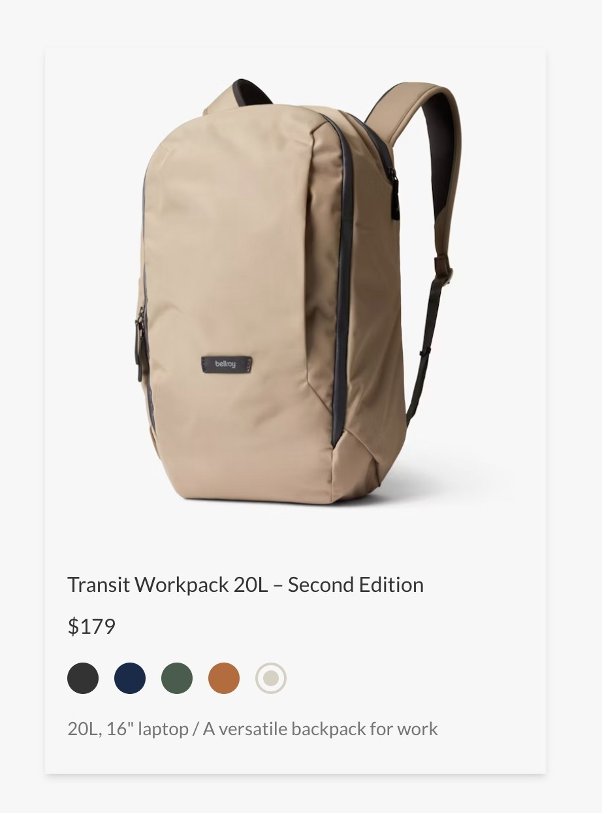

# Bellroy Product Card Component

An Elm-based interactive product card inspired by Bellroy's design, packaged within an Astro build.

## Description

This component showcases product details including product name, pricing, color variants, and brief descriptions. It demonstrates responsive design, fetching external product data, interactive UI controls, and maintainable CSS architecture using Tailwind CSS integrated within Astro.

## Features

* **Responsive Design:** Ensures optimal viewing on mobile, tablet, and desktop.
* **Interactive Color Selection:** Users can select available colors, and the selected color is visually highlighted.
* **Structured Elm Architecture:** Component follows Elm best practices, ensuring maintainable and easily testable code.
* **Astro Integration:** Seamlessly integrated into Astro for optimized static site generation.

## Technology Stack

* **Elm** for frontend logic
* **Astro** for packaging and static site generation
* **Tailwind CSS** for styling
